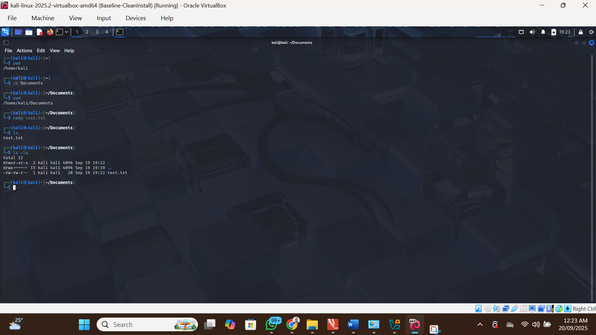
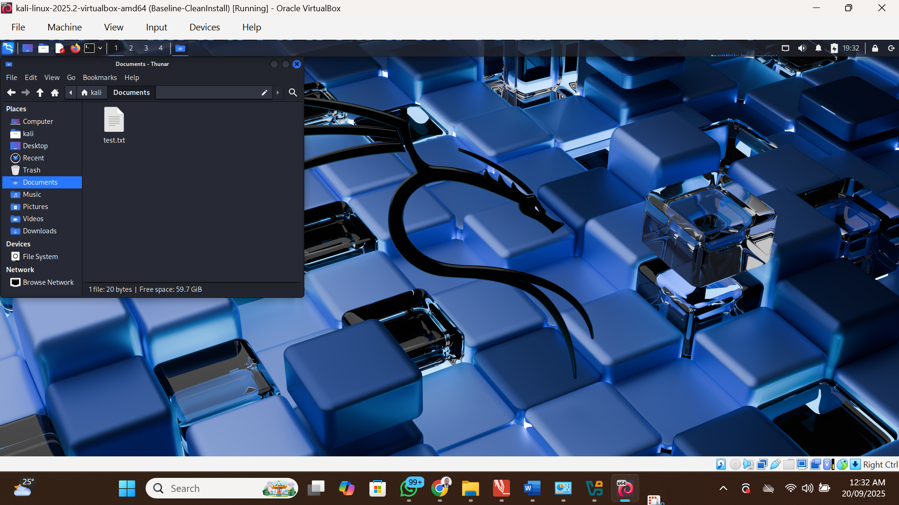

# Day 02 – Linux Basics Practice 🐧

## Actions Completed
- Ran 5 Linux commands in Kali: `ls -la`, `pwd`, `mkdir & cd`, `nano test.txt`, `chmod 644 test.txt`.
- Saved command log: `linux-practice/linux_commands_day2.txt`.
- Uploaded screenshots to `assets/`.

## Proof / Files
- `linux-practice/linux_commands_day2.txt`
- `assets/day-02-terminal.png`
- `assets/day-02-testfile.png`

## Screenshots

