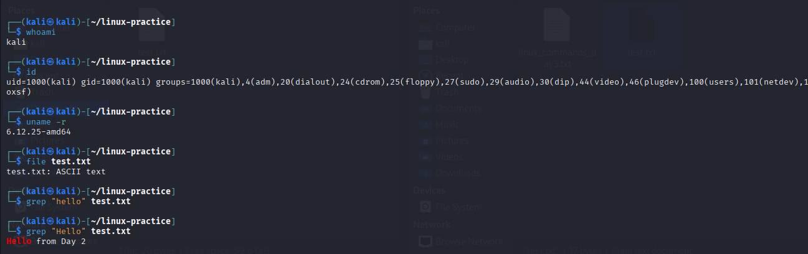
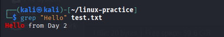

# Day 03 – Linux Fundamentals Practice 🐧

## Actions Completed
- Completed TryHackMe *Linux Fundamentals 1* (or continued with next module).
- Practiced 5 Linux commands in Kali: `whoami`, `id`, `uname -r`, `file test.txt`, `grep "Hello" test.txt`.
- Saved outputs in: `linux-practice/linux_commands_day3.txt`.
- Uploaded screenshots to `assets/`.

## Proof / Files
- `linux-practice/linux_commands_day3.txt`
- `assets/day-03-terminal.png`
- `assets/day-03-grep.png`

## Screenshots
  

